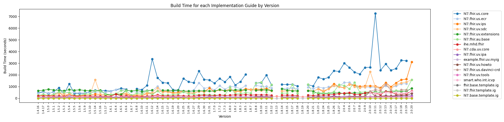

<!---
 ____________________
|                    |
|  N  O  T  I  C  E  |
|____________________|

Please maintain this README.md as a linkable document, as other documentation may link back to it. The following sections should appear consistently in all updates to this document to maintain linkability:

## Building this Project
## Running this Project
## Releases
## CI/CD
## Maintenance

--->

# HL7 FHIR IG Publisher Artifacts
[](https://scorecard.dev/viewer/?uri=github.com/HL7/fhir-ig-publisher) [](https://github.com/HL7/fhir-ig-publisher/actions/workflows/codeql.yml) [](https://github.com/HL7/fhir-ig-publisher/actions/workflows/owasp.yml) [](https://github.com/HL7/fhir-ig-publisher/actions/workflows/trivy.yml)


|                           CI Status (master)                           |                                                           Current Release |                Latest SNAPSHOT                |
|:----------------------------------------------------------------------:|--------------------------------------------------------------------------:|:---------------------------------------------:|
| [![Build Status][Badge-AzureMasterPipeline]][Link-AzureMasterPipeline] |                    [![Badge-MavenCentralReleases]][Link-GithubZipRelease] | ![Snapshot Artifact][Badge-SonatypeSnapshots] |

This is the code for the HL7 IG publisher: a tool to take a set of inputs
and create a standard FHIR IG. The HL7 FHIR IG publisher does not provide 
an authoring environment - that's left to other parties.

## Performance Monitoring



This graph plots the time taken to build a set of key implementation guides across
the versions of the IG publisher, which are performed as part of the QA release testing. 
Note that the implementation guides themselves change over time, and the time varies due to network 
dependencies, so these times are only a rough indication of performance.

Note: For some previous versions, the tests were run over a slow/obstructed starlink connection, so
have been removed from the graph

## Building this Project

You can find detailed instructions on setting up this project in your IDE [here](https://hl7.github.io/docs/ig_publisher/getting-started).

This project uses [Apache Maven][Link-Maven] to build. To build:

```shell
mvn install
```

To skip unit tests:

```shell
mvn -Dmaven.test.skip install
```

## Running this Project

Once built, this project produces an executable publisher jar file: `org.hl7.fhir.publisher.cli/target/org.hl7.fhir.publisher.cli-X.Y.Z-SNAPSHOT.jar`. Detailed documentation on its features and common use cases are located in the [Confluence Documentation](https://confluence.hl7.org/display/FHIR/IG+Publisher+Documentation), including instructions on how to run the publisher from your IDE.

In addition, two common publishing tasks that can be accomplished using the fhir-ig-publisher are described in detail in the documentation below:

* [Publishing Packages](https://hl7.github.io/docs/ig_publisher/publishing-packages)
* [Publishing Templates](https://hl7.github.io/docs/ig_publisher/publishing-templates)

## Docker

A Dockerfile exists for packaging the IG Publisher and its pre-requisite software as a Docker image.

To build the Docker image from within the project directory:

```shell
docker build -t fhir-ig-publisher:test .
```

You can use `docker run` to run the built docker image. Arguments in the Docker run command will be passed to the 
IG Publisher CLI. If you include the --rm parameter, the container by the run command generated will be removed after 
the command has been executed. If you wish to debug the container after a run, exclude this parameter.

```shell
docker run --rm fhir-ig-publisher:test
```

*Note: you will have to mount local files and directories in order for them to be accessed by the Docker container.*

```shell
docker run --mount type=bind,src=/path/to/an/ig-directory,dst=/usr/src/ig --rm fhir-ig-publisher:test -ig /usr/src/ig
```


## Releases

The built binary for the FHIR IG publisher is released through [GitHub releases][Link-GithubReleases] and can be downloaded directly [here][Link-GithubZipRelease].

## CI/CD

All integration and delivery done on Azure pipelines. Azure project can be viewed [here][Link-AzureProject].

* **Pull Request Pipeline** is automatically run for every Pull Request to ensure that the project can be built by maven. [[Azure Pipeline]][Link-AzurePullRequestPipeline] [[source]](pull-request-pipeline.yml)
* **Master Branch Pipeline** is automatically run whenever code is merged to the master branch and builds the SNAPSHOT binaries distributed to OSSRH [[Azure Pipeline]][Link-AzureMasterPipeline][[source]](master-branch-pipeline.yml)
* **Release Branch Pipeline** is run manually whenever a release is ready to be made. It builds the [release binaries](#releases) and distributes them to artifact repositories. [[Azure Pipeline]][Link-AzureReleasePipeline][[source]](release-branch-pipeline.yml)
* **Nightly xig Pipeline** is run automatically once a day to produce an aggregated view of all public IGs, available [here][Link-XigStatsOutput]. [[Azure Pipeline]][Link-AzureXigPipeline][[source]](nightly-xig-pipeline.yml)


A brief overview of our publishing process is [here][Link-Publishing].

For more detailed instructions on cutting a release, please read [the wiki][Link-PublishingRelease]

## Maintenance

Have you found an issue? Do you have a feature request? Great! Submit it [here][Link-GithubIssues] and we'll try to fix it as soon as possible.

This project is maintained by [Grahame Grieve][Link-grahameGithub] and [Lloyd McKenzie][Link-lloydmckenzie] on behalf of the FHIR community.


[Link-AzureMasterPipeline]: https://dev.azure.com/fhir-pipelines/ig-publisher/_build/latest?definitionId=33&branchName=master
[Link-AzureReleasePipeline]: https://dev.azure.com/fhir-pipelines/ig-publisher/_build/latest?definitionId=34&branchName=master
[Link-AzurePullRequestPipeline]: https://dev.azure.com/fhir-pipelines/ig-publisher/_build?definitionId=32
[Link-AzureXigPipeline]: https://dev.azure.com/fhir-pipelines/ig-publisher/_build?definitionId=48
[Link-XigStatsOutput]: https://fhir.org/guides/stats/
[Link-GithubIssues]: https://github.com/HL7/fhir-ig-publisher/issues
[Link-GithubReleases]: https://github.com/HL7/fhir-ig-publisher/releases
[Link-GithubZipRelease]: https://github.com/HL7/fhir-ig-publisher/releases/latest/download/publisher.jar "Sonatype Releases"
[Link-AzureProject]: https://dev.azure.com/fhir-pipelines/ig-publisher
[Link-Maven]: http://maven.apache.org

[Link-PublishingRelease]: https://hl7.github.io/docs/ci-cd-building-release
[Link-Publishing]: https://hl7.github.io/docs/ci-cd-publishing-binaries

[Link-grahameGithub]: https://github.com/grahamegrieve
[Link-lloydmckenzie]: https://github.com/lmckenzi

[Badge-AzureMasterPipeline]: https://dev.azure.com/fhir-pipelines/ig-publisher/_apis/build/status/Master%20Branch%20Pipeline?branchName=master
[Badge-AzureReleasePipeline]: https://dev.azure.com/fhir-pipelines/ig-publisher/_apis/build/status/Release%20Branch%20Pipeline?branchName=master
<!-- Badges-->
[Badge-MavenCentralReleases]: https://img.shields.io/maven-metadata/v?metadataUrl=https%3A%2F%2Frepo1.maven.org%2Fmaven2%2Forg%2Fhl7%2Ffhir%2Fpublisher%2Forg.hl7.fhir.publisher%2Fmaven-metadata.xml "Maven Central Releases"
[Badge-SonatypeSnapshots]:https://img.shields.io/maven-metadata/v?metadataUrl=https%3A%2F%2Fcentral.sonatype.com%2Frepository%2Fmaven-snapshots%2Forg%2Fhl7%2Ffhir%2Fpublisher%2Forg.hl7.fhir.publisher%2Fmaven-metadata.xml "Sonatype Snapshots"
## Debugging this project with VS-Code
Setup a launch.json file in the .vscode folder with the following content:
``` json
{
    // Use IntelliSense to learn about possible attributes.
    // Hover to view descriptions of existing attributes.
    // For more information, visit: https://go.microsoft.com/fwlink/?linkid=830387
    "version": "0.2.0",
    "configurations": [
        {
            "type": "java",
            "name": "Publisher",
            "request": "launch",
            "mainClass": "org.hl7.fhir.igtools.publisher.Publisher",
            "projectName": "org.hl7.fhir.publisher.core",
            "cwd": "c:/git/hl7/utg",
            "args": [
                "-ig", ".",
                "-tx", "http://tx.fhir.org/r4"
            ]
        }
    ]
}
```
Update the path to the location of the IG that you want to debug the generation of
and click debug in VS-Code.
